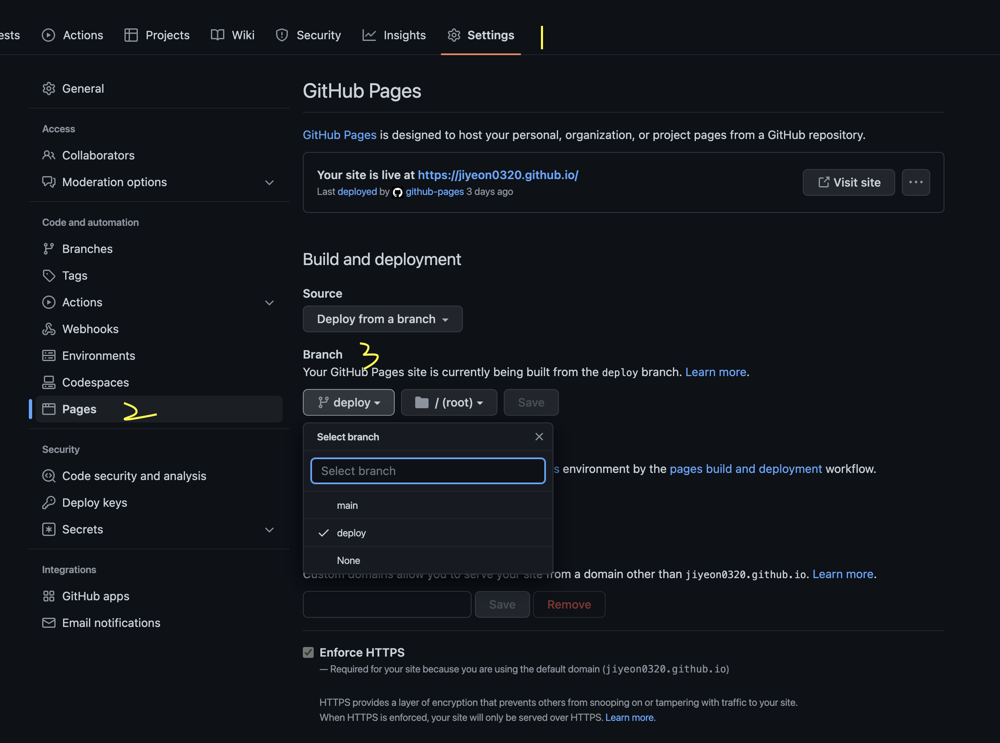

## 블로그 시작하기

프론트엔드로 일한지 3년차인 듯?
그렇지만 국비로 6개월 조금 안되는 과정으로 어찌저찌 취업이 되었는데!  
들어간 회사는 사수는 아예 없었고, 백엔드인 대표님만 계셨다.  
그래서 도움 받을 수 있는 곳이 없었어서 저어엉말정말정말 많이 헤맸다.  
(지금도 잘 몰라. 어떻게 여기까지 구현했는지 신기할 따름..)  
변수, 함수, 메서드, 파라미터, 키 값 등등 이런 용어들이 뭘 뜻하는지도 모른 채 하려니 너무 힘들었다.  
그래서 1년은 헤매다가 보낸 시간들이라 내 스스로는 경력으로 인정 안하게 되었다.  
그동안 헤맸던 것들은 많은데 그에 관한 기록들은 거의 전무해서 여태 내가 뭘 어떻게 해왔는지 전혀 기억이 안난다.
기능 구현하기 급급했던거지..

그러다 이직을 해야하는데 나를 어필할게 너무 없는것이다.  
전에도 블로그를 만들려고 시도해 봤지만 그 때는 이게 다 뭔 소리지 싶어서 실패.  
벨로그는 만들고 좀 끄적 댔지만 내가 원하는 블로그 형식이 아니여서 그런지 안쓰게 되서 실패.  
티스토리도 계정만 만들어두고 쓰지 않아서 실패.  
그렇지만 더 이상은 미룰 수 없다.  
내가 블로그를 만들자!  
그런데 디자인부터 다 하려니 일이 커지니까, 기본 포맷만 따자. 그럼 다시 개츠비.  
이렇게 돌아온 것.

## 개츠비로 블로그 개설하기

지금까지 리액트로 개발을 해왔었고, 리액트를 더 깊게 파보고 싶었다.  
그래서 리액트 기반의 Gatsby를 선택하게 되었다.

### 1. Gatsby-cli 설치

```
npm install -g gatsby-cli
```

### 2. 개츠비 기본 블로그 템플릿으로 받아오기

[Gatsby Starter](https://www.gatsbyjs.com/starters/)에서 테마를 고를 수 있다.
나는 커스텀할 목적으로 가장 기본 템플릿을 설치했다.

- 블로그를 만들 디렉토리 안에 들어간 후

```
npx gatsby new 내블로그이름 https://github.com/gatsbyjs/gatsby-starter-blog
```

완..성..?
잉? 이렇게 간단했다고? 전엔 이 과정도 너무 어려웠던거 같은데? 이렇게 쉽다고?

### 3. 로컬로 띄우기 -> 글쓰기

```
npm run start
```

- **root/content/blog** 안에 md 파일 생성해서 쓰면 된다.

### 4. GitHub에 블로그 등록하기

내 깃허브 레포지토리를 새로 생성해야 하는데 **[내UserName].github.io**로 지어준다.

")
블로그 만든 폴더에 들어가서 git init를 해주면 된다.

```
git init
git add .
git commit -m '커밋 메세지 쓰기'
git branch -M main
git remote add origin [레포 주소]
git push -u origin main
```

### 5. gh-pages로 블로그 배포하기

gh-pages를 디펜던시에 추가해준다.

```
npm install gh-pages --save-dev
```

package.json 파일의 script에 다음 명령어를 추가한다.

```
...
"deploy": "gatsby build && gh-pages -d public deploy -b deploy"
...
```

**gatsby build && gh-pages -d public deploy** : 배포하는 명령어
**-b deploy** : 배포하는 브랜치명(변경 가능)

배포하기

```
npm run deploy
```

### 6. GitHub에 블로그 세팅(환경설정)하기



블로그 레포에 들어간 후, Setting > Pages로 이동한다.
Branch 항목에서 package.json - script에 설정해둔 브랜치로 변경 해준다.
(기본 값 main에서 deploy로 변경. 배포를 해야 deploy 브랜치가 생긴다.)

### 7. 블로그 접속하기

활성화된 블로그에 접속하면 된다.
